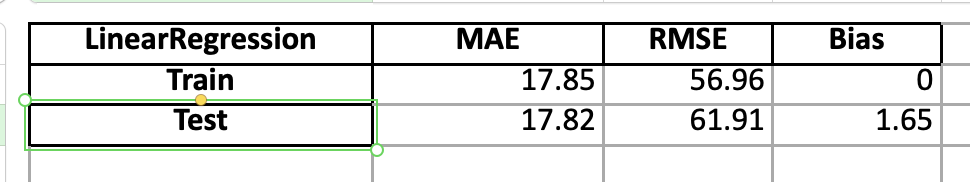
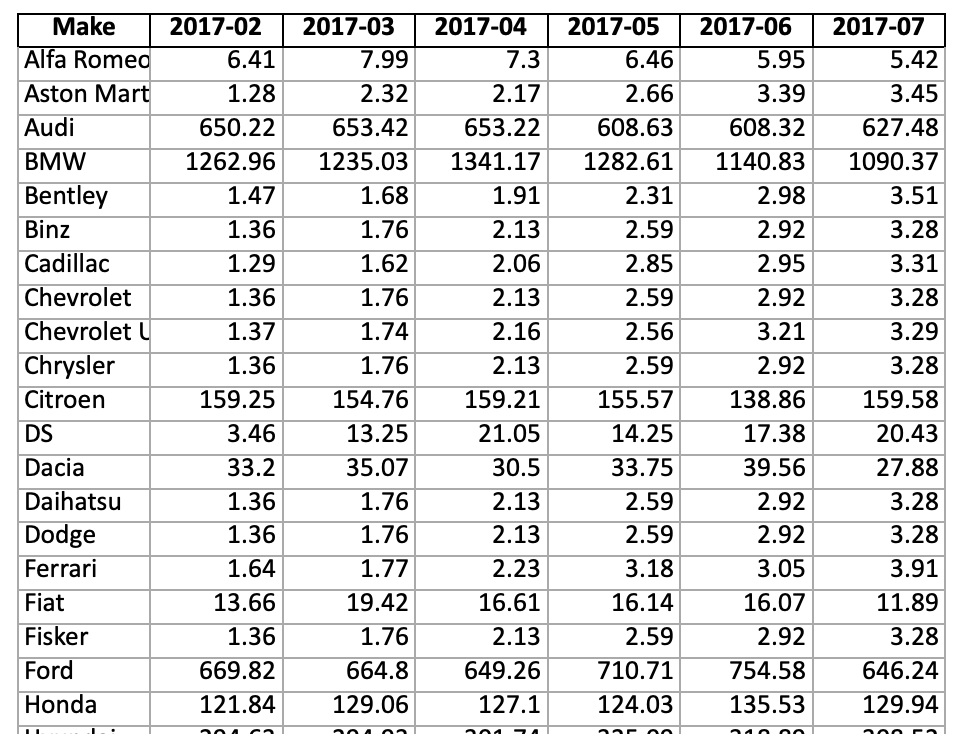
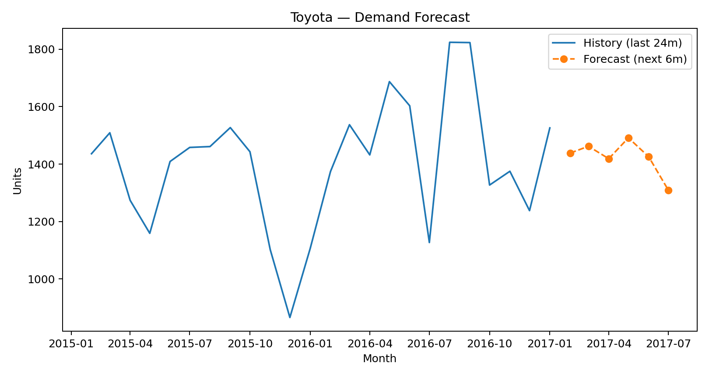

# 🚗 Norway Car Sales Forecasting

This project demonstrates how to forecast car sales in Norway using **Python, Pandas, and Scikit-Learn**.  
The dataset contains new car registrations by make, and the goal is to predict future demand based on historical trends.

---

## 📂 Project Structure
- `norway_forecast.py` → Main script (data prep, model training, KPI evaluation, and forecast)
- `save_plot.py` → Utility script for saving plots
- `requirements.txt` → Dependencies for reproducibility
- `docs/` → Visuals for KPIs, forecast tables, and plots
- `demand.xlsx` → Output Excel file with raw data, KPIs, forecasts, and combined history+forecast

---

## ⚙️ Methods
- **Data Cleaning & Transformation**: pivot by make and period, add totals
- **Supervised Dataset Generation**: sliding windows (`x_len=12`, `y_len=1`)
- **Modeling**: Linear Regression (`scikit-learn`)
- **Evaluation**: KPIs (MAE, RMSE, Bias)
- **Forecasting**: Predicts the next 6 months of demand

---

## 📊 Model KPIs


## 🔮 Forecast Results


## 📈 Forecast Plot


---

## 🚀 How to Run
```bash
conda create -n cars python=3.11 -y
conda activate cars
pip install -r requirements.txt
python norway_forecast.py
python save_plot.py